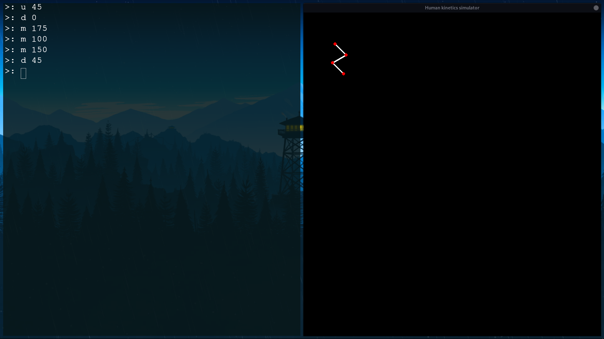
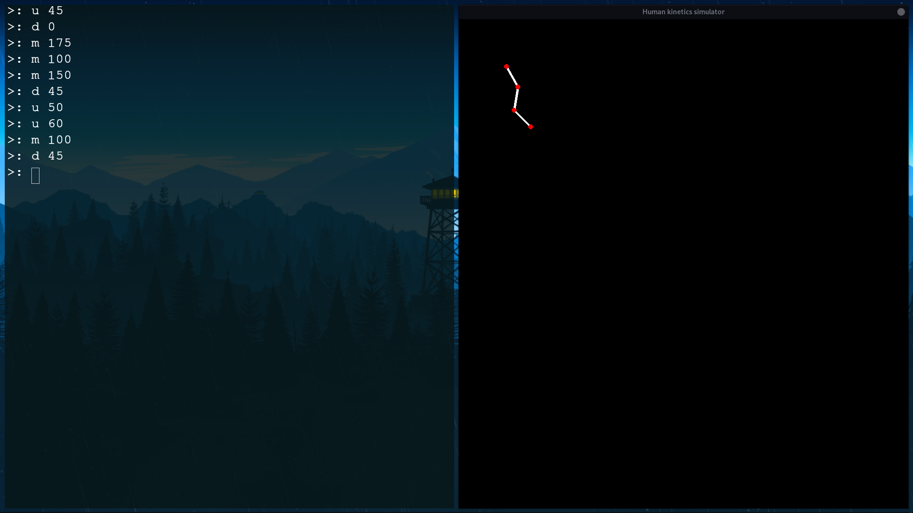

# Human Kinetics Simulator

## Overview
This is project was made to test the movement of the human limbs
for a project of a friend (When it is published I can put the link here).  
The program is written in `python` and uses the `pygame` library to display the "wanna-be" limbs.  
I aimed for the simplest interface imaginable, ensuring it could be effortlessly used without any technical hurdles.  
It works by reading commands inputed by the user and moving the limbs accordingly.

## Preview

### Screenshots



> [!TIP]  
> The following scripts assume you are using a Unix-like system.
If you are using Windows, you'll need to replace the `python3` command with just `python`.

## Features
- Move the parts based on a set of commands
- The commands can be either:
  - added before the simulation starts, on the actions list
  - added during the simulation, on the command line
- The parts can be moved individually or all at once

## Documentation
- The documentation is available on the [docs](docs) folder.  
- For detailed information on the real-time simulation, check the [Real-Time Simulation](docs/real_time_simulation.md) documentation.  
- For detailed information on the Leg object, check the [Leg](docs/leg.md) documentation.

## Dependencies
- Python 3.8
- Pygame 2.5.0 (or newer)

To install the dependencies, use `make`:
```bash
# to install the dependencies, run the tests and then run the program
make
# to only install the dependencies
make init
```

To get the dependencies manually, use pip:
```bash
pip install -r requirements.txt
```

## Usage

> [!WARNING]  
> Remember to install the [dependencies](#dependencies) before compiling the program.

To run the program, simply use `make`:
```bash
# to just run the program
make run
```
As said on [Dependencies](#dependencies), you can also run the program, install the dependencies and run the tests with `make`:
```bash
make
```
Or even to run manually:
```bash
python3 -m src.main
```

## Tests
To run the tests, use `make`:
```bash
make test
```
Or manually:
```bash
python3 -m unittest discover -s tests -p "*_test.py"
```

## Contributing
Feel free to contribute to this project by creating a pull request.

